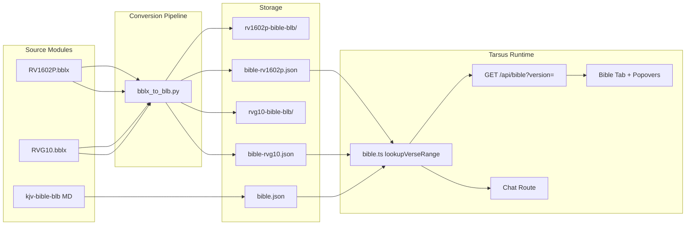

# Architect Handoff — Spanish Bible Feature for Tarsus

**To:** Google Antigravity AI (Architect)  
**From:** Cursor AI / Morgan (conversion pipeline)  
**Project:** `212G-TARSUS-Main-Ministry-Platform`  
**Date:** 2026-07-08  
**Status:** Data pipeline complete · UI + chat integration pending

---

## 1. Purpose

Enable Tarsus to serve **Spanish Bible text** alongside the existing English KJV, using the same lookup API and BLB markdown structure already used for `kjv-bible-blb`. Two Spanish translations are ready:

| Version ID | Full name | Source | Verses |
|---|---|---|---|
| `rv1602p` | Reina-Valera 1602 Purificada | `Support/RV1602P.bblx` | 31,102 |
| `rvg10` | Reina Valera Gómez 2010 | `Support/RVG10.bblx` | 31,102 |
| `kjv` | King James Version (existing) | `src/data/bible.json` | 31,102 |

Default API behavior remains **KJV** until the user or UI selects a Spanish version.

---

## 2. Source format — e-Sword `.bblx`

e-Sword v9+ Bible modules (including v13) store text in **SQLite** files with extension `.bblx`.

```
Tables:
  Details  — module metadata (Description, Abbreviation, Version, …)
  Bible    — Book INT (1–66), Chapter INT, Verse INT, Scripture TEXT
```

- `Scripture` contains **RTF-ish markup**: `{\i word}` (supplied words), `{\b heading}` (Psalm titles), `\par` line breaks.
- Not encrypted in our modules; readable with standard `sqlite3`.
- Conversion script: `Support/bblx_to_blb.py` (Python 3, no extra deps).

**Re-run conversion:**

```powershell
# RV1602P
python Support/bblx_to_blb.py

# RVG10
python Support/bblx_to_blb.py `
  --bblx Support/RVG10.bblx `
  --blb-out "C:\STORAGE\M\Manifold-Grace\3-RESOURCES(Pantry)\GMP-NOTES\rvg10-bible-blb" `
  --json-out src/data/bible-rvg10.json
```

---

## 3. Deliverables (already generated)

### 3.1 BLB markdown (vault reference library)

Same folder/chapter pattern as `GMP-NOTES/kjv-bible-blb`:

```
GMP-NOTES/rv1602p-bible-blb/
  OT/01-Genesis/Genesis-Chapter-01.md
  NT/04-John/John-Chapter-03.md
  … (1,189 chapter files)

GMP-NOTES/rvg10-bible-blb/
  (same structure)
```

**Verse line format** (matches KJV BLB):

```markdown
Gen 1:1  EN el principio creó Dios los cielos y la tierra. ^Ge1-1

---

Joh 3:16  Porque de tal manera amó Dios al mundo… ^Jn3-16
```

- Book folders use **English canonical names** (Genesis, John, …) for cross-link compatibility.
- Display abbreviations match KJV BLB (`Gen`, `Joh`, `1Sa`, …).
- Block anchors match KJV pattern (`^Ge1-1`, `^Jn3-16`) so existing wiki-link style can be reused.
- Italic supplied words from e-Sword → `[brackets]` (KJV BLB convention).

### 3.2 Runtime JSON (Tarsus app)

```
src/data/bible.json          — KJV (existing)
src/data/bible-rv1602p.json  — RV1602 Purificada
src/data/bible-rvg10.json    — RVG 2010
```

**Schema** (unchanged from KJV):

```json
{
  "Genesis": [
    {
      "ref": "Genesis 1:1",
      "book": "Genesis",
      "chapter": 1,
      "verse": 1,
      "text": "EN el principio creó Dios los cielos y la tierra."
    }
  ]
}
```

Book keys are **English canonical names**; `abbrevMap` in `src/lib/bible.ts` already resolves Spanish queries (`juan`, `mateo`, `genesis`, `salmos`, etc.).

---

## 4. Backend already wired (partial)

### 4.1 `src/lib/bible.ts`

- `BibleVersion`: `'kjv' | 'rv1602p' | 'rvg10'`
- `BIBLE_VERSIONS` — human labels + language codes
- `lookupVerseRange(book, chapter, start?, end?, version?)` — version-aware
- `listBooks(version?)` — version-aware
- In-memory cache per version (lazy load on first request)

### 4.2 `GET /api/bible`

```
/api/bible?book=John&chapter=3&start=16&end=16&version=rv1602p
/api/bible?book=Juan&chapter=3&version=rvg10
/api/bible?book=Mateo&chapter=5&version=kjv
```

| Param | Required | Notes |
|---|---|---|
| `book` | yes | English or Spanish name/abbrev (see `abbrevMap`) |
| `chapter` | yes | integer |
| `start` | no | verse range start |
| `end` | no | verse range end |
| `version` | no | `kjv` (default), `rv1602p`, `rvg10` |

**Response:**

```json
{
  "version": "rv1602p",
  "verses": [
    { "ref": "John 3:16", "book": "John", "chapter": 3, "verse": 16, "text": "…" }
  ]
}
```

---

## 5. Implementation tasks for Architect

### 5.1 UI — Bible Explorer tab (priority: high)

**Files:** `src/components/MainLayout.tsx`, `src/components/MainLayoutPage.tsx`

Current Bible tab fetches:

```ts
fetch(`/api/bible?book=${book}&chapter=${chapter}&start=1&end=200`)
```

**Required changes:**

1. Add version `<select>` with options from `BIBLE_VERSIONS`:
   - KJV (English)
   - RV1602 Purificada (Español)
   - RVG 2010 (Español)
2. Persist selection in `localStorage` (key suggestion: `tarsus-bible-version`).
3. Append `&version=${selectedVersion}` to all Bible API fetches.
4. Optional: show version label in tab header when Spanish is active.

### 5.2 UI — Bible reference popovers (priority: high)

**Files:** `src/components/BiblePopoverLink.tsx`, `BibleRefRenderer.tsx`

Popovers currently fetch KJV only. They should:

1. Read the same `tarsus-bible-version` preference (or accept a prop from context).
2. Pass `version` query param to `/api/bible`.
3. No regex changes needed — Spanish book names already match `BibleRefRenderer` pattern.

### 5.3 Chat / RAG — Spanish Bible in AI context (priority: medium)

**File:** `src/app/api/chat/route.ts`

Chat route does **not** yet inject Bible text into prompts. Recommended approach:

1. Detect scripture references in user query (reuse `BibleRefRenderer` regex or a shared util).
2. Resolve verses via `lookupVerseRange(..., version)` using user preference or explicit `@rv1602p` / `@rvg10` hint.
3. Inject resolved verses into system/context block, e.g.:

   ```
   [Scripture — RV1602P]
   Juan 3:16: Porque de tal manera amó Dios al mundo…
   ```

4. Default Spanish version when UI language is ES: suggest `rv1602p` or user choice.

### 5.4 Optional — MemPalace / search index (priority: low)

Spanish BLB markdown lives in vault (`GMP-NOTES/rv1602p-bible-blb`, `rvg10-bible-blb`) but is **not** in Tarsus search index. If scripture search in chat is desired:

- Add vault paths to `mempalace.yaml` or run a one-time index build.
- Or rely on direct JSON lookup (faster, deterministic).

### 5.5 Optional — user settings page (priority: low)

Central place for:
- Default Bible version
- Chat scripture injection on/off
- Per-session override

---

## 6. Architecture diagram



---

## 7. Known data quirks (source, not pipeline)

| Issue | Example | Notes |
|---|---|---|
| Missing space | RV1602P Joh 3:2: `estosmilagros` | Original e-Sword module |
| Color RTF wrappers | RVG10 uses `{\cf6 …}` for quoted speech | Pipeline unwraps via `clean_scripture()` |
| Archaic spelling | RV1602P: `fué`, `vió`, `haz` | Expected for 1602 text |
| Psalm headings | `— Salmo de David. —` prefix | Converted from `{\b …}` RTF |

Do **not** auto-fix without theological/editorial review.

---

## 8. Testing checklist

- [ ] `/api/bible?book=Genesis&chapter=1&version=rv1602p` returns 31 verses in Spanish
- [ ] `/api/bible?book=Juan&chapter=3&start=16&version=rvg10` resolves Spanish book name
- [ ] Bible tab version switch reloads chapter text
- [ ] Popover on `Juan 3:16` shows Spanish when version = `rv1602p`
- [ ] KJV remains default when `version` omitted
- [ ] `listBooks('rvg10')` returns 66 English canonical keys
- [ ] Chat injects scripture when user cites a reference (after 5.3 implemented)

---

## 9. File inventory

| Path | Role |
|---|---|
| `Support/RV1602P.bblx` | Source module (e-Sword) |
| `Support/RVG10.bblx` | Source module (e-Sword) |
| `Support/bblx_to_blb.py` | Conversion script |
| `src/data/bible-rv1602p.json` | Runtime data |
| `src/data/bible-rvg10.json` | Runtime data |
| `src/lib/bible.ts` | Lookup + version registry |
| `src/app/api/bible/route.ts` | REST endpoint |
| `GMP-NOTES/rv1602p-bible-blb/` | BLB markdown (vault) |
| `GMP-NOTES/rvg10-bible-blb/` | BLB markdown (vault) |
| `GMP-NOTES/kjv-bible-blb/` | Reference pattern (existing) |

---

## 10. Suggested implementation order

1. Shared React context or hook: `useBibleVersion()` reading/writing `localStorage`
2. Wire Bible Explorer tab + popovers to pass `version`
3. Smoke-test all three versions via API
4. Chat scripture injection using `lookupVerseRange`
5. (Later) MemPalace indexing of Spanish BLB if full-text scripture search is needed

---

## 11. Questions for product owner

1. **Default Spanish version:** RV1602P or RVG10 when user selects "Español"?
2. **Chat behavior:** Always inject cited verses, or only when user asks?
3. **Git:** JSON files are ~6–8 MB each — commit to repo or load from vault at build time?

---

*End of handoff. Pipeline is reproducible; architect owns UI integration and chat wiring.*
